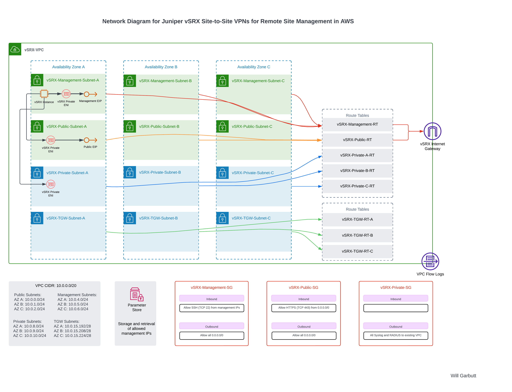

# VPN Architecture

This code describes the AWS CDK implementation of a vSRX-VPC architecture using Python. The CDK code defines and deploys the entire network infrastructure, including VPC, subnets, route tables, security groups, and vSRX instances.




Key Components of the CDK Implementation:

1.	VPC Configuration:
- Definition of the VPC with a /20 CIDR block
- Creation of four subnet types across three Availability Zones

2.	Subnet Layout:
- Public Subnets: Used for vSRX public interfaces and VPN termination
- Management Subnets: For secure administrative access
- Private Subnets: For internal resources and vSRX private interfaces
- TGW Subnets: Prepared for future Transit Gateway integration

3.	Routing Configuration:
- Creation of route tables for each subnet type
- Association of subnets with appropriate route tables

4.	Security Setup:
- Definition of Security Groups for different network segments
- Integration with AWS Systems Manager Parameter Store for managing allowed IP ranges

5.	vSRX Instance Deployment:
- Configuration of vSRX instances with multiple network interfaces
- Association with appropriate subnets and security groups

6.	Networking Components:
- Setup of Internet Gateway for public internet access
- Configuration of Elastic IPs for vSRX instances

7.	Logging and Monitoring:
- Implementation of VPC Flow Logs for network traffic analysis

The CDK code is organized into multiple stacks, including a VPC stack, a parameter stack, and a vSRX stack, allowing for modular and maintainable infrastructure definition.

This implementation allows for consistent deployment across multiple AWS accounts or regions, providing a standardized and secure cloud infrastructure.

## Components
### app.py
**Purpose:** This is the entry point of the CDK application. It defines the overall structure of the CDK app and orchestrates the creation and deployment of all stacks.  

**Key Components:**  
•	Initializes the CDK app  
•	Sets up the AWS environment (account and region)  
•	Creates and configures the Parameter, VPC, and vSRX stacks  
•	Manages dependencies between stacks  
•	Applies tags to all resources  

### rnet_parameter_stack.py
**Purpose:** Defines the Parameter Stack, which is responsible for creating and managing AWS Systems Manager Parameter Store parameters.  

**Key Components:**  
•	Creates StringParameters in Parameter Store for various vSRX configuration elements:  
- Approved IP addresses for vSRX management access  
 	- AMI name for vSRX instances  
  	- EC2 instance type for vSRX instances  
 	- Key pair name for vSRX instances  
  

- Allows for centralized management of:  
  	- Access control lists (approved management IPs)  
  	- vSRX AMI selection  
  	- Instance type configuration  
 	- SSH key pair selection  

### rnet_vpc_stack.py
**Purpose:** Defines the VPC Stack, which creates the core networking infrastructure.    

**Key Components:**  
•	Creates the VPC with a /20 CIDR block  
•	Defines and creates four types of subnets across three Availability Zones:  
•	Public Subnets  
•	Management Subnets  
•	Private Subnets  
•	TGW (Transit Gateway) Subnets  
•	Creates and associates route tables for each subnet type  
•	Sets up Internet Gateway and attaches it to the VPC  
•	Creates Security Groups for different network segments  
•	Implements VPC Flow Logs for network traffic analysis  
•	Outputs important resource IDs for reference  

### rnet_vsrx_stack.py
**Purpose:** Defines the vSRX Stack, which is responsible for deploying and configuring the Juniper vSRX instances.   

**Key Components:**  
•	Looks up the vSRX AMI  
•	Creates Elastic IPs for the vSRX instances  
•	Creates network interfaces for the vSRX in the appropriate subnets  
•	Associates Elastic IPs with the network interfaces  
•	Creates an IAM role and instance profile for the vSRX instances  
•	Deploys the vSRX instances with the correct configuration  
•	Outputs relevant information about the vSRX deployment  


## Modifying key parameters

To modify key parameters of the infrastructure, you'll need to update the values in the `parameter_stack.py` file. Here are the main parameters you might want to modify:

 **vSRX Instance Type:**
 In `parameter_stack.py`, locate the VSRXInstanceType parameter and modify its string_value:

```python
   ssm.StringParameter(
       self, "VSRXInstanceType",
       parameter_name="/vsrx/instance-type",
       string_value="c5.xlarge",  # Modify this value
       description="EC2 instance type for vSRX instances",
       tier=ssm.ParameterTier.STANDARD
   )
```

**Allowed Management IPs:**
Update the list in `parameter_stack.py`:
```python
approved_ips = [
    "X.X.X.X/32",  # Modify or add IPs as needed
    "X.X.X.X/32",
    # Add more IPs as needed
]
```

**vSRX AMI Name:**
To update the AMI name, modify the VSRXAmiName parameter:
```python
ssm.StringParameter(
    self, "VSRXAmiName",
    parameter_name="/vsrx/ami-name",
    string_value="junos-vsrx3-x86-64-23.4R2",  # Modify this value
    description="AMI name for vSRX instances",
    tier=ssm.ParameterTier.STANDARD
)
```

To get the latest AMI details use this AWS CLI command to return the marketplace AMI details:
``` Powershell
aws ec2 describe-images `
>> >>   --owners aws-marketplace `
>> >>   --filters "Name=name,Values=junos-vsrx3-x86-64-*" "Name=is-public,Values=true" `
>> >>   --query "sort_by(Images, &CreationDate)[-1].[ImageId,Name]" `
>> >>   --output text `
>> >>   --region ap-southeast-1 `
```

**SSH Key Pair Name:**
To change the SSH key pair used for the vSRX instances, update the VSRXKeyPairName parameter:
``` Python
ssm.StringParameter(
    self, "VSRXKeyPairName",
    parameter_name="/vsrx/key-pair-name",
    string_value="vSRXKeyPair",  # Modify this value
    description="Key pair name for vSRX instances",
    tier=ssm.ParameterTier.STANDARD
)
```

**VPC CIDR Block:** Open `vpc_stack.py` and locate the VPC creation. Modify the cidr_block parameter:
``` python
self.vpc = ec2.CfnVPC(self, "vSRX-VPC",
    cidr_block="10.0.0.0/20",  # Modify this value
    ...
```

**Subnet CIDR Blocks:** In the same file, find the subnet_config list and update the CIDR blocks as needed:
``` Python
subnet_config = [
    ("Public", ["10.0.0.0/24", "10.0.1.0/24", "10.0.2.0/24"]),  # Modify these
    ("Management", ["10.0.4.0/24", "10.0.5.0/24", "10.0.6.0/24"]),  # Modify these
```

**Deploying the CDK**
``` powershell
cdk bootstrap --profile (PROFILE NAME)
cdk deploy vSRX-Parameter-Stack --profile (PROFILE NAME) --require-approval never  
cdk deploy --all --profile (PROFILE NAME) --require-approval never  
```

