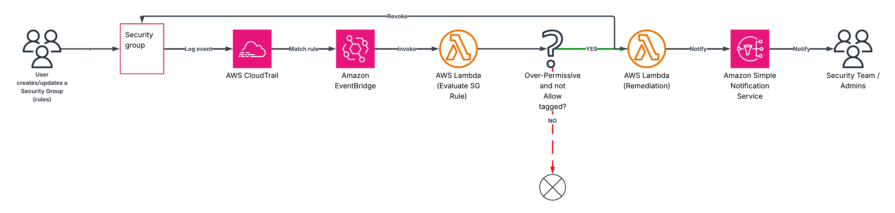
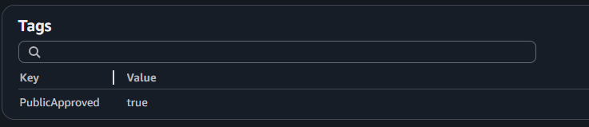
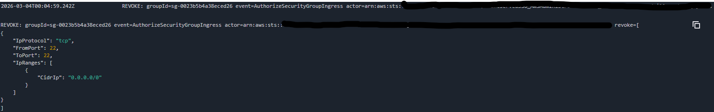

# AWS Security Group Ingress Guard

Automatically prevents overly permissive Security Group rules in AWS.

This project deploys a Lambda + EventBridge rule that detects when a user opens a Security Group to the internet (`0.0.0.0/0` or `::/0`) and automatically revokes the rule unless the Security Group is explicitly tagged as allowed.

---

## Problem

Security Groups are often accidentally opened to the internet.

Examples:

- SSH open to the world (`22 -> 0.0.0.0/0`)
- Databases exposed publicly (`5432`, `3306`)
- Internal services exposed externally

These mistakes can happen via:

- AWS Console
- CLI
- Terraform
- CloudFormation
- Scripts

AWS does not natively provide a simple preventative control for this scenario, for example with SCP's

This project implements an automated guardrail that acts in near real-time (seconds) and some smarts around notifications and failsafes

---

## Architecture



Flow:

1. A user creates or modifies a Security Group rule.
2. CloudTrail logs the API call.
3. EventBridge detects the event.
4. Lambda evaluates the rule.
5. If the rule is open and not allow-listed:
   - The rule is revoked.
   - An SNS notification is sent.

---

## Features

- Detects open ingress (`0.0.0.0/0` and `::/0`)
- Supports both:
  - `AuthorizeSecurityGroupIngress`
  - `ModifySecurityGroupRules`
- Tag based allow-listing
- SNS alerting
- EventBridge retry + DLQ
- CloudWatch logging
- Fully deployable via CloudFormation

---


## Allow-listing a Security Group

To intentionally allow public access, add the allow tag:

    PublicApproved = true

Example:



After tagging, the Lambda will no longer revoke the rule.

---

## Example: Blocked Rule

User creates:

    SSH
    Port: 22
    Source: 0.0.0.0/0

Result:

- Lambda automatically revokes the rule
- SNS notification sent
- Event logged in CloudWatch

Example log:



---

## Parameters

| Parameter | Description | Default |
|-----------|-------------|--------|
| AllowTagKey | Tag used to allow public rules | `PublicApproved` |
| AllowTagValue | Required value for allow tag | `true` |
| EnforceAllPorts | Enforce for all ports or only specific ones | `false` |
| DenyPortsCsv | Ports to block when world-open | `22,3389` |
| NotificationEmail | Optional email for alerts | none |

---


## Security Notes

This tool provides **reactive enforcement**.

The rule may exist briefly before being revoked.

---


## Notification email example
```
{
  "action": "REVOKED_WORLD_OPEN_INGRESS",
  "groupId": "sg-0023b5b4a38eced26",
  "eventName": "AuthorizeSecurityGroupIngress",
  "actorArn": "arn:aws:sts::",
  "sourceIp": "163.47.242.37",
  "time": "2026-03-04T00:04:56Z",
  "allowTag": "PublicApproved=true",
  "enforceAllPorts": false,
  "denyPorts": [
    22,
    3389
  ],
  "revokedIpPermissions": [
    {
      "IpProtocol": "tcp",
      "FromPort": 22,
      "ToPort": 22,
      "IpRanges": [
        {
          "CidrIp": "0.0.0.0/0"
        }
      ]
    }
  ]
}
`

